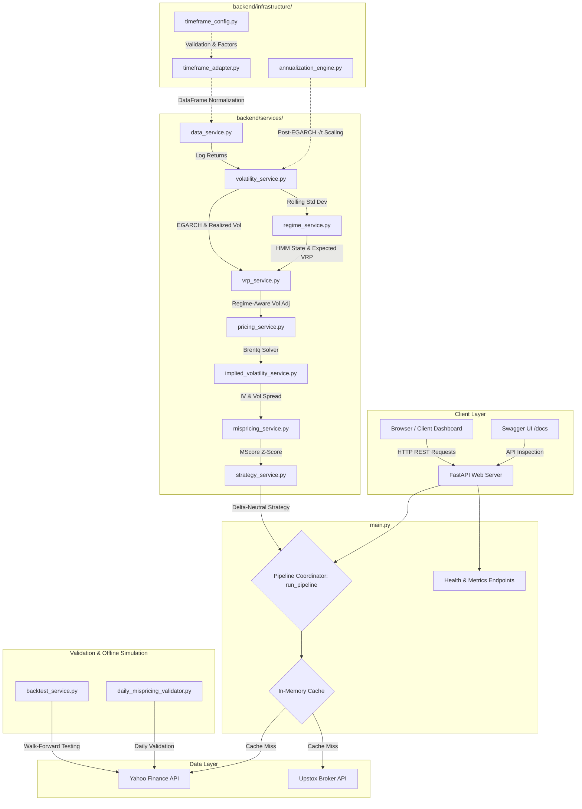
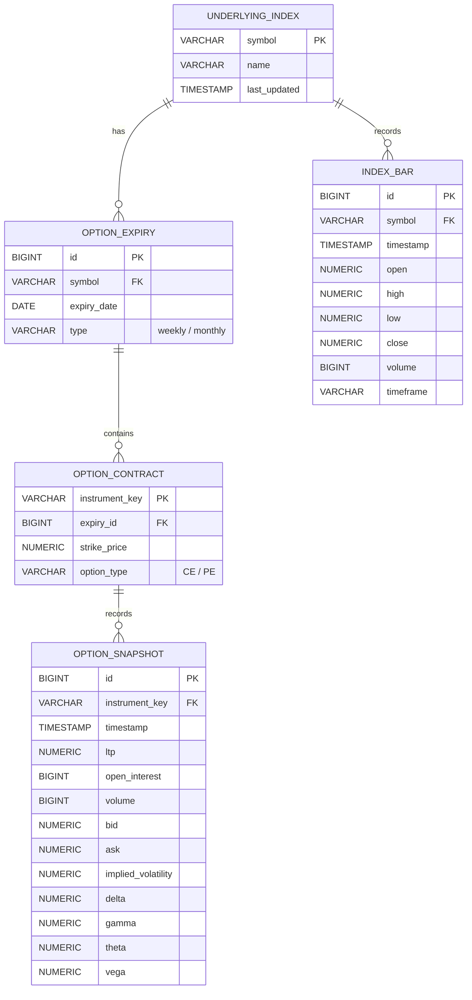
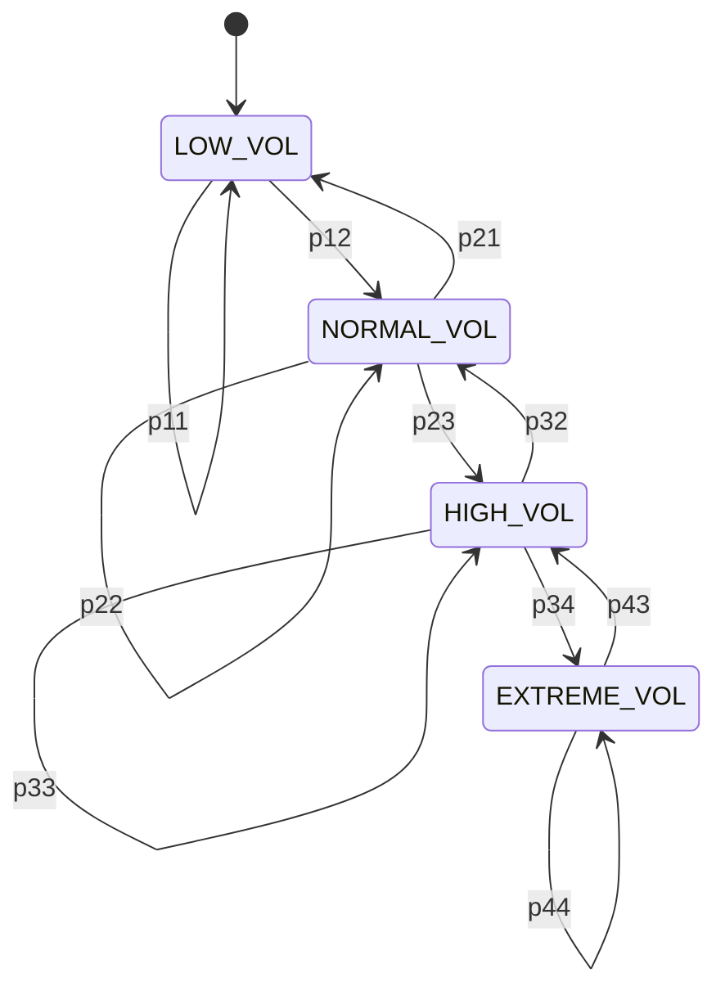

# Quantitative Options Mispricing Detection System (NIFTY 50)
## Comprehensive Technical Audit, Architectural Design, and Resume Defense Guide

This document contains a comprehensive, staff-engineer-level reverse-engineered analysis of the entire Option Mispricing Detection and Strategy Recommendation codebase. It is designed to prepare you for rigorous technical interviews at top-tier fintech, quantitative trading, and banking institutions (such as IDFC FIRST Bank).

---

## PART 1 — PROJECT OVERVIEW

### 1.1 The Core Problem
In options trading, market implied volatility (IV) is commonly used to price contracts. However, using IV creates a circular dependency: IV is derived from option market prices (which are driven by supply-demand imbalances, retail speculation, order-flow dynamics, and liquidity constraints), but it is also used to evaluate if an option is "cheap" or "expensive."

This project solves this circularity by building an **independent theoretical pricing baseline**. It forecasts the asset's true conditional volatility using historical data (via an EGARCH model), adjusts it for the Volatility Risk Premium (VRP), and applies the Black-Scholes model to determine the option's theoretical fair value. Comparing this fair value with the actual market price reveals statistically significant mispricing.

### 1.2 Target Users and Business Use Cases
- **Quantitative Options Traders & Market Makers**: To scan the NIFTY 50 options chain for liquid, mispriced contracts to capture delta-neutral volatility premium.
- **Risk Managers & Desk Heads**: To identify tail-risk exposure (e.g., when the market-implied regime diverges significantly from historical volatility regimes).
- **Fintech & Brokerage Platforms**: As a value-added decision-support engine for retail/institutional clients (like Dhan or Upstox users) looking for rule-based strategy recommendations.

### 1.3 End-to-End Workflow
1. **Data Ingestion**: Fetch daily NIFTY index spot data (Yahoo Finance `^NSEI`) and live option chain quotes (LTP, bid/ask, IV, OI, Volume from Upstox).
2. **Preprocessing**: Normalize dataframes, handle time zones, and compute log returns.
3. **Volatility Forecasting**: Fit an EGARCH(1,1) model to trailing daily returns. Compute realized volatility from intraday 5-minute and 15-minute intervals. Fuse them into a final annualized volatility forecast. Compute the Timeframe Coherence Index (TCI).
4. **Volatility Risk Premium (VRP) Adjustment**: Calculate the difference between current option IV and forecasted volatility. Use a Hidden Markov Model (HMM) to classify the volatility regime and project the expected VRP.
5. **Calibrated Pricing**: Calculate the Black-Scholes fair price using the VRP-adjusted volatility ($\sigma_{adj}$).
6. **Mispricing & Score Generation**: Compute a Greeks-augmented composite mispricing score ($MScore$) based on price deviation, Vega, Gamma, TCI, and VRP deviation. Translate this into a Z-score.
7. **Strategy Generation**: Recommend a delta-neutral structure (e.g., long straddle/strangle for underpriced volatility; short straddle/iron condor for overpriced volatility) based on the volatility regime and signal strength.
8. **REST API Interface**: Expose these steps via FastAPI endpoints.

---

### 1.4 Interview Elevator Pitches

#### 30-Second Pitch (The Hook)
> "I built an AI-assisted options mispricing detection system for the NIFTY 50 index that removes the circular dependency of implied volatility. By forecasting conditional volatility using an EGARCH(1,1) model fitted on historical daily and intraday returns, my system computes an independent Black-Scholes fair value. It then overlays a Hidden Markov Model to classify volatility regimes and dynamically adjusts for the Volatility Risk Premium. The engine generates structured, delta-neutral strategy recommendations and is deployed via a containerized FastAPI backend with live Upstox broker data integration."

#### 1-Minute Pitch (The Technical Summary)
> "My project is a Volatility Risk Premium and options mispricing detection engine targeting NIFTY 50 index options. To avoid the circularity of using implied volatility for valuation, I estimate the underlying asset's true volatility using a daily EGARCH(1,1) model fused with intraday realized volatility. This forecast is dynamically adjusted using an expected VRP derived from an HMM volatility regime classifier (low, normal, high, extreme). 
>
> We use this adjusted volatility to compute the Black-Scholes fair price. Rather than relying on simple price deviations, I designed a composite mispricing score that accounts for Vega, Gamma, a Timeframe Coherence Index, and VRP deviations. The final output is a Z-score signal that triggers delta-neutral strategy recommendations like straddles or iron condors. The system is exposed through FastAPI and containerized using Docker."

#### 3-Minute Pitch (The Architecture & Methodology)
> "I built a quantitative pipeline that identifies options mispricing by comparing market prices to an independent econometric benchmark. 
>
> The data pipeline uses a custom `timeframe_adapter` to clean daily and intraday index candles. The volatility engine uses the `arch` library to fit an EGARCH(1,1) model, which captures leverage effects (the asymmetric volatility response to negative shocks). We fuse this forecast with realized volatility from 5-minute and 15-minute bar intervals.
>
> To model the Volatility Risk Premium (VRP), we calculate the historical spread between implied and forecasted volatility. We feed this into a Gaussian Hidden Markov Model to classify the market state into one of four regimes (Low, Normal, High, Extreme Volatility). This HMM provides the regime-conditional expected VRP, which we add to our forecast to create a calibrated volatility input ($\sigma_{adj}$) for our Black-Scholes pricing model.
>
> We solve for market implied volatility using Brent's root-finding method on the Black-Scholes formula. We then calculate a composite mispricing score ($MScore$) weighted across price deviation, Vega, Gamma, VRP deviation, and the Timeframe Coherence Index (which measures volatility dispersion across timescales). This score is normalized into a rolling Z-score. If the Z-score exceeds our threshold and the expected profit covers transaction costs, the system recommends a delta-neutral options structure, using iron condors in high-volatility regimes to define risk, and straddles in low-volatility regimes.
>
> The pipeline is written in Python, exposed via FastAPI, containerized with Docker, and includes a walk-forward backtesting engine to validate signal predictive power."

#### 5-Minute Pitch (The Staff-Level Breakdown)
> "My project addresses a core market efficiency problem: detecting structural option mispricings in the highly liquid NIFTY 50 index derivatives market. 
>
> The system is designed as a modular, decoupled quantitative pipeline:
>
> 1. **Data & Preprocessing**: Our ingestion layer handles data from Yahoo Finance and Upstox. The `timeframe_adapter` normalizes columns, aligns timestamps to India Standard Time (IST), removes duplicate bars, and performs conservative forward-filling to avoid look-ahead bias.
> 
> 2. **Volatility Modeling**: Volatility is the most critical unobservable parameter in options pricing. I chose EGARCH(1,1) because Nelson’s exponential formulation guarantees positive variance without artificial parameter constraints, and it models the leverage effect typical in equity indexes. To capture multi-timescale dynamics, we combine the daily EGARCH forecast with realized volatility computed from 5-minute and 15-minute bar returns. We also introduce a Timeframe Coherence Index (TCI)—calculated as the variance of volatility across different frequencies—to measure volatility instability.
>
> 3. **Regime-Conditioned VRP**: Option implied volatilities typically trade at a premium to realized volatility (the Volatility Risk Premium). To estimate this dynamically, we model VRP using a Gaussian Hidden Markov Model (HMM) from the `hmmlearn` library. The HMM classifies the market state into low, normal, high, or extreme volatility regimes. We compute the regime-conditional mean and standard deviation of VRP, and use the regime-conditional expected VRP to adjust our forecast, resulting in a calibrated volatility input ($\sigma_{adj}$).
>
> 4. **Independent Valuation**: We use the adjusted volatility ($\sigma_{adj}$) in our Black-Scholes pricing engine. To solve for the option's implied volatility, we implement a solver using Scipy’s `brentq` root-finding algorithm to invert the Black-Scholes formula.
>
> 5. **Signal & Strategy Engine**: Instead of relying on a simple price difference, we compute a composite mispricing score ($MScore$) that incorporates price deviation, Vega impact, Gamma risk, TCI, and VRP deviation. We convert this score into a Z-score using a rolling 60-period window. If the Z-score indicates overpricing, we generate a short-volatility strategy (short straddle or risk-defined iron condor). If it indicates underpricing, we recommend a long-volatility strategy (long straddle or strangle). All strategies are centered around the at-the-money (ATM) strike to maintain delta-neutrality.
>
> 6. **Production & Validation**: The backend is built with FastAPI, using uvicorn as the ASGI server. We use in-memory caching to avoid redundant API requests. I also developed a rolling, out-of-sample walk-forward backtesting engine to evaluate the signal's predictive power. The system is containerized via Docker for standardized deployment."

---

## PART 2 — SYSTEM ARCHITECTURE

### 2.1 Technical Architecture Diagram (Mermaid)



### 2.2 Architectural Tradeoffs & Alternatives

| Component | Selected Approach | Alternatives Considered | Tradeoffs & Justification |
| :--- | :--- | :--- | :--- |
| **API Framework** | **FastAPI + Uvicorn** | Flask, Django, Express.js | FastAPI provides native async support, automatic OpenAPI/Swagger generation, and strict data validation via Pydantic. It is much faster than Flask and lighter than Django. |
| **Database** | **None (In-Memory Caching)** | PostgreSQL, Redis, MongoDB | Currently, the API operates as a stateless calculator using memory-based dictionaries/deques. This keeps the setup simple and fast, but lacks persistent historical snapshot storage. |
| **Vol Forecasting** | **EGARCH(1,1)** | GARCH(1,1), LSTM, Heston | Standard GARCH cannot model leverage effects. LSTM networks lack interpretability and are prone to overfitting on financial noise. EGARCH is statistically rigorous, handles leverage effects, and ensures positive variance. |
| **Option Data Ingestion** | **Upstox API / yfinance fallback** | Dhan API, Interactive Brokers | Upstox provides NIFTY index options chain quotes in India. yfinance provides a reliable spot index price backup. |
| **Regime Classifier** | **Hidden Markov Model (HMM)** | K-Means, Decision Trees | HMM is a probabilistic model that captures regime transitions over time. Unlike static K-Means clustering, HMM models the probability of moving from a low-volatility state to a high-volatility state based on transition matrices. |

### 2.3 System Scalability Analysis
- **Current Bottleneck**: The system is entirely single-threaded and keeps state in global Python objects (`_vrp_window`, `_regime_windows`, `run_pipeline.cache`). If multiple parallel requests trigger the pipeline, the thread-blocking CPU work (fitting EGARCH and the HMM model) will increase latency.
- **Production Scaling Strategy**:
  1. Move the EGARCH fitting and HMM training to a background worker process (using Celery or Redis Queue) that runs on a schedule (e.g., once every hour or day). Store the fitted parameters in Redis.
  2. Use Redis for cross-process caching instead of Python dictionary caching.
  3. Deploy the FastAPI app behind an Nginx load balancer inside a Kubernetes cluster, scaling the pods horizontally to handle request volume.

---

## PART 3 — DIRECTORY WALKTHROUGH

```
MajorProject/
├── backend/
│   ├── infrastructure/
│   │   ├── timeframe_config.py      # Core definitions of timescales, annualization factors
│   │   ├── timeframe_adapter.py     # Structural cleaning, sorting, duplicate removal
│   │   └── annualization_engine.py  # Volatility post-processing via square root of time
│   └── services/
│       ├── data_service.py          # Yahoo Finance index downloader and returns builder
│       ├── volatility_service.py    # EGARCH modeling, realized vol computation, vol fusion
│       ├── pricing_service.py       # Black-Scholes valuation formula for calls and puts
│       ├── implied_volatility_service.py # Brent's solver to invert Black-Scholes
│       ├── VRP_service.py            # Volatility Risk Premium calculation & expectation modeling
│       ├── regime_service.py        # HMM model training and state classification
│       ├── mispricing_service.py    # Price deviation & composite MScore/Z-score signal
│       ├── strategy_service.py      # Delta-neutral option structure generator
│       ├── option_chain_service.py  # Live Upstox options chain ingestion and fallback logic
│       ├── option_chain_filters.py  # Liquidity checker (Open Interest, Volume, Spread)
│       └── backtest_service.py      # Walk-forward backtester & statistical evaluator
├── validation/
│   ├── daily_mispricing_validator.py # Daily historical validation runner
│   └── daily_validator_simple.py      # Simplified daily validator
├── scripts/
│   └── upstox_token.py              # Upstox API OAuth exchange handler
├── main.py                          # FastAPI endpoint router and application setup
├── Dockerfile                       # Container deployment definition
├── requirements.txt                 # Third-party dependency definitions
└── .env                             # Environment configuration variables
```

### Rationale Behind the Design
The repository separates concerns into:
- **Infrastructure**: Normalizes incoming data structures and handles timeframes, ensuring the service layer receives clean inputs.
- **Services**: Standalone mathematical and financial engines. This decoupling allows you to test or swap out models (e.g., replacing EGARCH with GJR-GARCH) without affecting the API endpoints or ingestion logic.
- **Validation**: Independent offline simulation scripts used to run backtests on historical data and generate performance reports.

---

## PART 4 — FILE-BY-FILE ANALYSIS

### 4.1 `main.py`
- **Purpose**: Web API Controller and Request Orchestrator.
- **Responsibility**: Exposes REST endpoints, manages in-memory performance metrics, and coordinates the quantitative pipeline through `run_pipeline()`.
- **Interactions**: Calls every service inside `backend/services/` and configurations from `backend/infrastructure/`.
- **Execution Flow in `run_pipeline`**:
  1. Checks cache for symbol and timeframe.
  2. Fetches index returns via `data_service.py`.
  3. Forecasts volatility and computes TCI using `volatility_service.py`.
  4. Classifies the market regime using `regime_service.py`.
  5. Fetches the live option chain from `option_chain_service.py`. If this fails, it falls back to synthetic option pricing.
  6. Solves for implied volatility and computes VRP using `implied_volatility_service.py` and `vrp_service.py`.
  7. Calculates Black-Scholes fair prices via `pricing_service.py` using the adjusted volatility ($\sigma_{adj}$).
  8. Computes the mispricing deviation and composite Z-score using `mispricing_service.py`.
  9. Generates strategy recommendations using `strategy_service.py`.
- **Design Patterns**: **Facade Pattern** (`run_pipeline` simplifies access to multiple underlying services) and **Cache Pattern** (function-scoped TTL dictionary).

#### Possible Interview Questions & Gotchas
> **Q: How does the caching mechanism in `run_pipeline` handle multiple concurrent users?**
>
> **Answer**: Currently, `run_pipeline.cache` is a standard Python dictionary. This is not thread-safe. If multiple requests modify this dictionary concurrently in a multi-threaded server, it could lead to race conditions. In a production environment, this should be replaced with a distributed cache like **Redis**.

---

### 4.2 `backend/infrastructure/timeframe_config.py`
- **Purpose**: Hardcoded mapping of timeframes to annualization factors.
- **Responsibility**: Validates timeframe inputs and maps trading horizons to their default timeframes (e.g., `day_trader` -> `5m`, `positional` -> `daily`, `long_term` -> `weekly`).
- **Mathematical Grounding**: Define annualization factors:
  - Daily: 252 trading days/year.
  - 1m: $252 \times 390 = 98,280$ intervals/year (based on 6.5 trading hours/day).
  - 5m: $252 \times 78 = 19,656$ intervals/year.
- **Design Patterns**: **Registry Pattern** (maps timeframe strings to metadata objects).

---

### 4.3 `backend/infrastructure/timeframe_adapter.py`
- **Purpose**: Normalizes data structures.
- **Responsibility**: Sorts data chronologically, removes duplicate timestamps, converts indices to datetime format, and applies forward-filling (`ffill()`) followed by `dropna()`.
- **Why Forward-Fill?**: Forward-filling is standard in financial time series to handle missing bars (like periods with no trading volume) without leaking future information.

#### Possible Interview Questions & Gotchas
> **Q: Why do you forward-fill (`ffill`) first and then drop missing values (`dropna`)?**
>
> **Answer**: `ffill()` propagates the last known valid observation forward. If the dataset has missing values at the very beginning, `ffill` cannot fill them because there are no prior values. Calling `dropna()` afterward ensures these initial NaN rows are removed, leaving a clean dataset.

---

### 4.4 `backend/infrastructure/annualization_engine.py`
- **Purpose**: Scales periodic volatility forecasts to annualized values.
- **Responsibility**: Implements the square root of time rule:
  $$\sigma_{\text{annual}} = \sigma_{\text{period}} \times \sqrt{N}$$
  Where $N$ is the number of periods in a year.
- **Gotcha**: This is a post-processing layer. It scales volatility *after* the EGARCH forecast is computed to keep the model parameters clean.

---

### 4.5 `backend/services/data_service.py`
- **Purpose**: Handles market data fetching.
- **Responsibility**: Downloads OHLCV data from Yahoo Finance (`yf.download`) using dynamic lookback windows (e.g., 10 years for daily data, 60 days for 5-minute data). It flattens MultiIndex column headers and converts timezone inputs to India Standard Time (IST).
- **Execution Limit**: Limits returned data to `TARGET_CANDLES = 2000` to prevent memory issues.

#### Possible Interview Questions & Gotchas
> **Q: If yfinance fails or returns a MultiIndex header, how does your code handle it?**
>
> **Answer**: The code flattens the columns using a list comprehension: `data.columns = [col[0] if isinstance(col, tuple) else col for col in data.columns]`. This extracts the base metric name (e.g., "Close") and drops the ticker level, preventing down-stream key errors.

---

### 4.6 `backend/services/volatility_service.py`
- **Purpose**: Volatility Forecast Engine.
- **Responsibility**: Fits Nelson's Exponential GARCH (EGARCH(1,1)) model to daily return data. It fuses the daily forecast with realized volatility from 5-minute and 15-minute intervals.
- **Mathematical Formula (EGARCH(1,1))**:
  $$\ln(\sigma_t^2) = \omega + \alpha \left| \frac{\epsilon_{t-1}}{\sigma_{t-1}} \right| + \gamma \frac{\epsilon_{t-1}}{\sigma_{t-1}} + \beta \ln(\sigma_{t-1}^2)$$
  The parameter $\gamma$ captures the **leverage effect** (if $\gamma < 0$, negative shocks increase volatility more than positive shocks of the same magnitude).
- **Timeframe Coherence Index (TCI)**:
  $$\text{TCI} = \text{Variance}(\sigma_{\text{daily}}, \sigma_{\text{hourly}}, \sigma_{15\text{m}}, \sigma_{5\text{m}})$$
  Measures volatility dispersion across different timescales.

#### Possible Interview Questions & Gotchas
> **Q: Why scale returns by 100 before fitting the EGARCH model in the `arch` library?**
>
> **Answer**: The numerical optimization algorithms in the `arch` library can fail to converge if the scale of the return data is too small (e.g., daily returns around 0.0015). Multiplying returns by 100 scales the variance to a range that is easier for the solver to optimize. The resulting forecast is then divided by 100 to scale it back to decimals.

---

### 4.7 `backend/services/pricing_service.py`
- **Purpose**: Options valuation engine.
- **Responsibility**: Computes the Black-Scholes theoretical fair price for European Call and Put options.
- **Core Math (Black-Scholes)**:
  $$d_1 = \frac{\ln(S/K) + (r + 0.5 \sigma^2)T}{\sigma \sqrt{T}}, \quad d_2 = d_1 - \sigma \sqrt{T}$$
  $$\text{Call Value} = S N(d_1) - K e^{-r T} N(d_2)$$
  $$\text{Put Value} = K e^{-r T} N(-d_2) - S N(-d_1)$$
- **Volatility Parameter**: Uses the VRP-adjusted volatility $\sigma_{adj} = \sigma + \text{VRP}_{\text{expected}}$ to price options.

---

### 4.8 `backend/services/implied_volatility_service.py`
- **Purpose**: Solves for market implied volatility.
- **Responsibility**: Inverts the Black-Scholes formula using Brent's method (`brentq` solver) to find the root where:
  $$f(\sigma) = \text{BS\_Price}(\sigma) - \text{Market\_Price} = 0$$
- **Solver Constraints**: Solves within the boundaries `[0.0001, 5.0]` (0.01% to 500% IV). Returns `None` if the solver fails to converge.

---

### 4.9 `backend/services/vrp_service.py`
- **Purpose**: Computes and projects the Volatility Risk Premium.
- **Responsibility**: Calculates VRP as the difference between implied and forecasted volatility:
  $$\text{VRP} = \text{IV} - \sigma_{\text{forecast}}$$
- **Expectation Modes**: Models expected VRP using a simple rolling mean, an Exponential Moving Average (EMA), or regime-conditioned historical averages.

---

### 4.10 `backend/services/regime_service.py`
- **Purpose**: Volatility regime classifier.
- **Responsibility**: Fits a Hidden Markov Model (HMM) with Gaussian emissions (`GaussianHMM`) to classify the market state into 3 or 4 regimes (Low, Normal, High, Extreme).
- **HMM Ordering**: Orders the states by their mean volatility so that state 0 represents the lowest volatility and state 3 represents the highest.

---

### 4.11 `backend/services/mispricing_service.py`
- **Purpose**: Generates mispricing signals.
- **Responsibility**: Computes the price deviation:
  $$\text{Price Deviation} = \frac{\text{Market Price} - \text{Fair Price}}{\text{Fair Price}}$$
  Calculates a composite mispricing score ($MScore$) and converts it into a rolling Z-score:
  $$MScore = w_1 \text{PriceDeviation} + w_2 \text{Vega} + w_3 \text{Gamma} + w_4 \text{TCI} + w_5 \text{VRPDeviation}$$

#### Possible Interview Questions & Gotchas
> **Q: How does the rolling Z-score behave at startup when there are few data points?**
>
> **Answer**: The `_z_score` helper uses a `deque` with a maximum length of 60. If there are fewer than 2 entries, it returns 0.0. This prevents startup errors but introduces a warm-up period during which no signals are generated.

---

### 4.12 `backend/services/strategy_service.py`
- **Purpose**: Options strategy generator.
- **Responsibility**: Suggests delta-neutral options strategies based on the volatility regime and mispricing signal:
  - If overpriced: Sell volatility (short straddle in low-vol; iron condor in high/extreme-vol to define risk).
  - If underpriced: Buy volatility (long straddle if Z-score is high; long strangle if Z-score is moderate).
  - If fair: No trade.

---

### 4.13 `backend/services/option_chain_service.py`
- **Purpose**: Ingests options market data.
- **Responsibility**: Connects to the Upstox `/option/chain` API for NIFTY. If the token is missing or the request fails, it falls back to fetching spot prices from yfinance and generating synthetic option prices.
- **GOTCHA**: This fallback is essential for testing but must be disabled or flagged in production to prevent trading on simulated prices.

---

### 4.14 `backend/services/option_chain_filters.py`
- **Purpose**: Filters options for liquidity.
- **Responsibility**: Checks three liquidity conditions:
  1. Open Interest (OI) $\ge$ 1,000 contracts.
  2. Volume $\ge$ 500 contracts.
  3. Bid-Ask Spread $\le$ 1% of LTP.

---

### 4.15 `backend/services/backtest_service.py`
- **Purpose**: Evaluates historical signal performance.
- **Responsibility**: Runs an out-of-sample rolling backtest. It fits the EGARCH model on a rolling window of returns, computes signals, and calculates performance metrics (Sharpe ratio, t-statistic, hit rate) and ablation results.

---

## PART 5 — EXECUTION FLOW

```
[System Startup]
  │
  ▼
uvicorn main:app
  │
  ├── 1. Load FastAPI App & Configuration
  │      - Read environment variables from .env
  │      - Set weights, thresholds, and tokens
  │
  ├── 2. Initialize In-Memory Metrics Store
  │      - Initialize global `METRICS` dictionary
  │
  ▼
[Endpoint Request: GET /strategy]
  │
  ├── 1. Validate Input Parameters
  │      - Run validate_symbol() and validate_timeframe()
  │
  ├── 2. Check Cache
  │      - Search `run_pipeline.cache` for symbol & timeframe
  │      - Cache Hit? Return cached data.
  │      - Cache Miss? Proceed to step 3.
  │
  ├── 3. Fetch Underlying Market Data (data_service.py)
  │      - Download index candles from Yahoo Finance
  │      - Normalize dataframe via timeframe_adapter.py
  │      - Compute log returns
  │
  ├── 4. Generate Volatility Forecast (volatility_service.py)
  │      - Scale returns and fit EGARCH(1,1)
  │      - Fetch intraday prices to compute realized volatility
  │      - Fuse daily EGARCH & intraday realized volatility
  │      - Compute Timeframe Coherence Index (TCI)
  │
  ├── 5. Determine Market Volatility Regime (regime_service.py)
  │      - Fit GaussianHMM on rolling historical volatility
  │      - Classify current volatility forecast into a regime
  │
  ├── 6. Fetch Option Chain Quotes (option_chain_service.py)
  │      - Call Upstox API `/option/chain`
  │      - Fallback to yfinance spot & synthetic pricing if API fails
  │
  ├── 7. Calculate Implied Volatility (implied_volatility_service.py)
  │      - Solve for IV using Brent's method on the Black-Scholes formula
  │
  ├── 8. Calculate Expected VRP (vrp_service.py)
  │      - VRP = IV - forecasted volatility
  │      - Estimate expected VRP using HMM regime-conditioned historical VRPs
  │      - Compute adjusted volatility: σ_adj = forecast_vol + VRP_expected
  │
  ├── 9. Value Option & Detect Mispricing (pricing & mispricing services)
  │      - Price option using Black-Scholes with σ_adj
  │      - Compute price deviation & composite MScore
  │      - Compute rolling Z-score
  │
  ├── 10. Generate Strategy (strategy_service.py)
  │       - Recommend delta-neutral strategy based on Z-score and regime
  │
  ├── 11. Format API Response & Log Event
  │       - Wrap payload in success envelope
  │       - Update global request metrics
  │       - Log structured execution metadata
  │
  ▼
[Return JSON Response to Client]
```

---

## PART 6 — API ANALYSIS

Every API endpoint is exposed via `main.py` using FastAPI:

| Endpoint | Method | Input Parameters | Validation Rules | Primary Operations |
| :--- | :--- | :--- | :--- | :--- |
| `/health` | GET | None | None | Returns backend status and execution time. |
| `/metrics` | GET | None | None | Returns API request counts and error rates. |
| `/nifty` | GET | `symbol` (str), `timeframe` (str) | Symbol format must match regex `[A-Z0-9\-^]+` | Fetches index candles and returns them as JSON. |
| `/returns` | GET | `symbol` (str), `timeframe` (str) | Same as above | Computes and returns the log returns series. |
| `/forecast-vol`| GET | `symbol` (str), `timeframe` (str) | Same as above | Fits the EGARCH model and returns the forecast. |
| `/fair-price` | GET | `symbol` (str), `trading_horizon` (str) | Horizon must be `day_trader`, `positional`, `long_term`, or `None` | Computes the theoretical Black-Scholes fair price. |
| `/mispricing` | GET | `symbol` (str), `trading_horizon` (str) | Same as above | Returns the price deviation and mispricing classification. |
| `/regime` | GET | `symbol` (str), `timeframe` (str) | Same as above | Returns the current HMM volatility regime. |
| `/strategy` | GET | `symbol` (str), `trading_horizon` (str), `timeframe` (str), `expiry` (str), `expiry_type` (str) | Expiry format must be `YYYY-MM-DD` | Runs the entire pipeline and returns a strategy suggestion. |
| `/backtest` | GET | `symbol` (str), `timeframe` (str) | Timeframe must be `1m`, `5m`, `15m`, or `1d` | Runs the walk-forward backtest and returns metrics. |
| `/option-chain`| GET | `symbol` (str), `expiry` (str), `depth` (int) | Depth must be positive | Returns the normalized and filtered options chain. |

---

## PART 7 — DATABASE DESIGN (PROPOSED)

The current codebase does not use a database; it processes data in-memory and caches requests using Python dictionaries. 

To support real option data history and snapshot storage (as outlined in Phase A of `implementation.md`), a relational database (like PostgreSQL) is recommended to manage the structured options data.

### Proposed Entity-Relationship Diagram (ERD)



### Proposed Schema DDL & Indexes

```sql
CREATE TABLE underlying_index (
    symbol VARCHAR(20) PRIMARY KEY,
    name VARCHAR(100) NOT NULL,
    last_updated TIMESTAMP WITH TIME ZONE DEFAULT CURRENT_TIMESTAMP
);

CREATE TABLE index_bar (
    id BIGSERIAL PRIMARY KEY,
    symbol VARCHAR(20) REFERENCES underlying_index(symbol),
    timestamp TIMESTAMP WITH TIME ZONE NOT NULL,
    open NUMERIC(12, 4) NOT NULL,
    high NUMERIC(12, 4) NOT NULL,
    low NUMERIC(12, 4) NOT NULL,
    close NUMERIC(12, 4) NOT NULL,
    volume BIGINT NOT NULL,
    timeframe VARCHAR(10) NOT NULL,
    CONSTRAINT unique_symbol_timestamp_tf UNIQUE (symbol, timestamp, timeframe)
);

CREATE INDEX idx_index_bar_query ON index_bar (symbol, timeframe, timestamp DESC);

CREATE TABLE option_expiry (
    id BIGSERIAL PRIMARY KEY,
    symbol VARCHAR(20) REFERENCES underlying_index(symbol),
    expiry_date DATE NOT NULL,
    expiry_type VARCHAR(20) NOT NULL,
    CONSTRAINT unique_symbol_expiry UNIQUE (symbol, expiry_date)
);

CREATE TABLE option_contract (
    instrument_key VARCHAR(100) PRIMARY KEY,
    expiry_id BIGINT REFERENCES option_expiry(id),
    strike_price NUMERIC(10, 2) NOT NULL,
    option_type VARCHAR(2) CHECK (option_type IN ('CE', 'PE'))
);

CREATE TABLE option_snapshot (
    id BIGSERIAL PRIMARY KEY,
    instrument_key VARCHAR(100) REFERENCES option_contract(instrument_key),
    timestamp TIMESTAMP WITH TIME ZONE NOT NULL,
    ltp NUMERIC(10, 2) NOT NULL,
    open_interest BIGINT NOT NULL,
    volume BIGINT NOT NULL,
    bid NUMERIC(10, 2),
    ask NUMERIC(10, 2),
    implied_volatility NUMERIC(6, 4),
    delta NUMERIC(6, 4),
    gamma NUMERIC(6, 4),
    theta NUMERIC(10, 4),
    vega NUMERIC(10, 4)
);

CREATE INDEX idx_opt_snap_query ON option_snapshot (instrument_key, timestamp DESC);
```

### Potential Scalability Issues
Storing options data generates a high volume of writes. A single options chain with 100 active strikes updated every minute generates 120,000 snapshots daily per index. 
- **Solution**: Set up a partitioning strategy on the `option_snapshot` table based on the `timestamp` column (e.g., daily or weekly partitions). Define a data retention policy to archive snapshots older than three months to cold storage (such as AWS S3).

---

## PART 8 — AI / ML DEEP DIVE

The core machine learning component in this project is the **Hidden Markov Model (HMM)** used for classifying volatility regimes in `regime_service.py`.



### 8.1 Why HMM for Volatility Regimes?
Financial markets are regime-dependent: periods of low volatility behave differently from periods of high volatility, showing distinct statistical properties. Volatility is not directly observable and must be inferred from asset price movements.

An HMM is well-suited for this because it assumes the market transitions between hidden states (regimes) according to a transition probability matrix, and the observed volatility in each state follows a probability distribution (in this case, a Gaussian distribution).

### 8.2 HMM Model Setup
- **Library**: `hmmlearn.hmm.GaussianHMM`
- **Features**: Trailing 60-day annualized realized volatility.
- **Hidden States**: 4 states (LOW_VOL, NORMAL_VOL, HIGH_VOL, EXTREME_VOL).
- **Emissions**: Gaussian distributions defined by a mean ($\mu_k$) and variance ($\sigma_k^2$) for each state $k$.

### 8.3 Mathematical Formulation
The probability of transitioning from state $i$ to state $j$ is defined by the transition matrix:
$$A = \{p_{ij}\} = P(q_t = S_j \mid q_{t-1} = S_i)$$

The emission probability of observing a volatility value $x_t$ given the state $q_t = S_k$ is modeled as a normal distribution:
$$b_k(x_t) = P(x_t \mid q_t = S_k) = \frac{1}{\sqrt{2\pi\sigma_k^2}} \exp\left(-\frac{(x_t - \mu_k)^2}{2\sigma_k^2}\right)$$

During inference, we compute the state probabilities for a new volatility observation using the Forward algorithm, and classify the regime as the state with the highest probability:
$$q_t^* = \arg\max_{k} P(q_t = S_k \mid x_1, x_2, \dots, x_t)$$

### 8.4 Evaluation & Limitations
- **Evaluation**: HMMs are unsupervised models and do not have standard labels. We evaluate their performance by analyzing the separation of the mean volatilities ($\mu_k$) across states and checking the stability of the transition matrix.
- **Limitations**: HMMs assume that transition probabilities are constant over time and that emissions follow a normal distribution. During sudden market shocks, the model can lag in transitioning to the extreme volatility regime.
- **Hallucination/Misclassification Risk**: The model can misclassify temporary volatility spikes as regime changes. We manage this by calculating a confidence score based on the state probability and applying a minimum lookback window to prevent frequent regime switches.

---

## PART 9 — TECHNOLOGY DEEP DIVE

### 9.1 FastAPI
- **What it is**: A modern Python web framework for building APIs.
- **Internal Mechanism**: It is built on top of Starlette (for web routing and ASGI support) and Pydantic (for data validation). It uses python's native `asyncio` loop to handle concurrent connections efficiently.
- **Interview Question**: How does FastAPI handle concurrent requests compared to Flask?
  - **Answer**: Flask uses the WSGI standard, which is synchronous and blocks the thread handling the request. To handle concurrent requests, Flask relies on thread pools. FastAPI uses the ASGI standard and runs on an event loop. Using `async def` allows FastAPI to yield control during I/O operations (like fetching data from external APIs), enabling a single thread to handle thousands of concurrent requests.

### 9.2 Nelson's EGARCH(1,1)
- **What it is**: Nelson's Exponential Autoregressive Conditional Heteroskedasticity model.
- **Internal Mechanism**: It models the logarithm of conditional variance, which guarantees that the variance forecast is always positive:
  $$\ln(\sigma_t^2) = \omega + \alpha \left| \frac{\epsilon_{t-1}}{\sigma_{t-1}} \right| + \gamma \frac{\epsilon_{t-1}}{\sigma_{t-1}} + \beta \ln(\sigma_{t-1}^2)$$
- **Interview Question**: What is the primary advantage of EGARCH over standard GARCH?
  - **Answer**: Standard GARCH requires positive parameters ($\alpha \ge 0, \beta \ge 0$) to ensure that the forecasted variance is positive. EGARCH models the log-variance ($\ln(\sigma_t^2)$), which is always positive regardless of the parameter signs. Additionally, the term $\gamma \frac{\epsilon_{t-1}}{\sigma_{t-1}}$ models the leverage effect, allowing the model to capture the asymmetry where negative shocks increase volatility more than positive shocks.

---

## PART 10 — KEY ENGINEERING DECISIONS

### 10.1 Daily EGARCH + Intraday Realized Volatility Fusion
- **Decision**: Combine the daily EGARCH forecast with realized volatility calculated from 5-minute and 15-minute intervals.
- **Alternatives**: Use a pure daily EGARCH model or a pure high-frequency realized volatility calculation.
- **Tradeoffs**:
  - **Daily EGARCH**: Captures long-term volatility clustering and leverage effects but is slow to respond to intraday price spikes.
  - **Intraday Realized Volatility**: Responsive to immediate price movements but incorporates market noise and lacks memory.
  - **Fused Approach**: Fuses both models using weighted averages (e.g., 70% daily, 30% intraday) to balance responsiveness and stability.
- **Alternative Risk**: Using only the daily model makes the system slow to adjust during sudden intraday news events. Using only the intraday model generates noisy signals and increases transaction costs.

### 10.2 Global State vs. Stateless Design
- **Decision**: Keep the cache and rolling metrics in global memory (`_vrp_window`, `_regime_windows`).
- **Alternatives**: Use an external state store (such as Redis or PostgreSQL).
- **Tradeoffs**:
  - **In-Memory**: Fast to implement and has zero query latency, but it makes the application stateful. This prevents running multiple instances of the container behind a load balancer, as each instance would maintain its own local cache and metrics.
  - **Production Alternative**: In production, the state must be moved to Redis to make the API containers stateless and horizontal-scaling friendly.

---

## PART 11 — SECURITY ARCHITECTURE

- **Authentication/Authorization**: The system currently stores the Upstox API keys and tokens in a plain-text `.env` file. The API endpoints do not have access controls or authentication mechanisms.
- **Injection Risks**: The `validate_symbol` helper uses a regex filter:
  ```python
  re.fullmatch(r"[A-Z0-9\-\^]+", symbol)
  ```
  This prevents injection attacks by rejecting input characters like SQL operators or shell commands.
- **Secrets Management**: Storing API keys in a `.env` file exposes them to leakage risks. In production, these secrets should be managed using a secure key store, such as AWS Secrets Manager or HashiCorp Vault, and injected into the container at runtime.
- **SSL/HTTPS**: The application runs on HTTP. Production deployments must configure SSL/TLS termination at the load balancer or reverse proxy level (e.g., using Nginx or AWS ALB) to encrypt API traffic.

---

## PART 12 — PERFORMANCE & BOTTLENECKS

### 12.1 Algorithmic Complexity

| Process | Computational Complexity | Bottleneck Source | Mitigation Strategy |
| :--- | :--- | :--- | :--- |
| **EGARCH Fitting** | $\mathcal{O}(I \times N)$ | Maximum likelihood estimation requires iterative calculations. | Cache the daily forecast; fit the model asynchronously in a background worker once per day. |
| **HMM Fitting** | $\mathcal{O}(I \times K^2 \times N)$ | The Baum-Welch EM algorithm scales quadratically with the number of states ($K$). | Cache the fitted HMM parameters; run model training as an offline batch process. |
| **IV Solver** | $\mathcal{O}(L \times M)$ | Brent's root-finding method requires evaluating the cumulative normal distribution at each iteration. | Optimize the solver search space; use parallel processing to solve multiple contracts. |

### 12.2 Database Query Optimization
If the proposed PostgreSQL database is implemented, options data queries will require optimization due to the volume of writes.
- **Indexes**: Create composite indexes on partition keys to optimize queries:
  ```sql
  CREATE INDEX idx_snapshot_composite ON option_snapshot (instrument_key, timestamp DESC);
  ```
- **Connection Pooling**: Use connection pooling libraries (like `pgbouncer` or python's `asyncpg`) to manage database connections efficiently, reducing the overhead of opening new connections for each request.

---

## PART 13 — INTERVIEW QUESTIONS (100 organized by difficulty)

### Easy (25 Questions)
1. What is the difference between historic volatility and implied volatility?
2. What parameters are required to calculate the Black-Scholes option price?
3. How is log return calculated, and why do we prefer it over simple returns?
4. What is the role of the risk-free rate in options pricing?
5. What does the term "delta-neutral" mean in options trading?
6. Explain the concept of at-the-money (ATM) options.
7. What is the difference between a call option and a put option?
8. Explain Nelson's EGARCH model in simple terms.
9. What is the purpose of the `/health` endpoint in FastAPI?
10. How do you load environment variables from a `.env` file in Python?
11. What is the role of `uvicorn` in a FastAPI deployment?
12. Why do we sort returns chronologically before running time series models?
13. What are options Greeks? Name the four primary Greeks.
14. What does the `arch` library in Python do?
15. What is the standard number of trading days in a year used in finance?
16. How does the square root of time rule scale volatility?
17. What is a bid-ask spread?
18. What is open interest (OI) and how does it differ from volume?
19. What is the difference between a straddle and a strangle?
20. What is a cumulative distribution function (CDF)?
21. Why does the API return time in UTC ISO format?
22. How do you run a FastAPI application locally?
23. What is the purpose of the `.gitignore` file?
24. What does `math.isfinite` check, and why is it used?
25. Explain the difference between CE and PE in Indian options markets.

### Medium (25 Questions)
26. How do you implement Brent's root-finding method to calculate implied volatility?
27. Describe the leverage effect in financial markets and how EGARCH models it.
28. Why does the system fuse daily and intraday volatility forecasts?
29. Explain how the Timeframe Coherence Index (TCI) is calculated and interpreted.
30. Walk through the mathematical steps to calculate $d_1$ and $d_2$ in the Black-Scholes formula.
31. How does a Hidden Markov Model identify different volatility regimes?
32. What is the Volatility Risk Premium (VRP), and how is it computed in this project?
33. Explain the circular dependency problem of implied volatility.
34. Why do we scale returns by 100 before fitting the EGARCH model?
35. How does the Upstox API fallback mechanism work in `option_chain_service.py`?
36. Describe the structure of an Iron Condor and when you would recommend it.
37. What is the Baum-Welch algorithm used for in HMMs?
38. Explain the difference between forward-filling and back-filling in time series data.
39. How do you determine the ATM strike price programmatically?
40. What is a rolling Z-score, and how is it used to detect mispricing?
41. Why does the system filter out options with low open interest and volume?
42. Describe the difference between symmetric GARCH and asymmetric EGARCH.
43. What is the put-call parity relation, and how is it used in pricing?
44. How does the FastAPI dependency injection framework work?
45. Explain how the walk-forward backtest is implemented in this codebase.
46. What is the purpose of the Docker multi-stage build?
47. How do you handle timezone conversions between UTC and IST in Pandas?
48. What is the t-statistic, and how does it evaluate trading strategy performance?
49. Why do we use log returns instead of simple returns for volatility modeling?
50. What is the role of the transition matrix in a Hidden Markov Model?

### Hard (25 Questions)
51. What is the mathematical proof that EGARCH variance is guaranteed to be positive?
52. How does the Viterbi algorithm differ from the forward-backward algorithm in HMMs?
53. Explain the stationary distribution of a Markov chain and its relation to volatility regimes.
54. Why does the backtest engine implement an out-of-sample walk-forward loop?
55. Under what market conditions does the Black-Scholes model overprice out-of-the-money options?
56. How does the choice of lookback window size affect the stability of the HMM regime classifier?
57. What are the numerical stability risks when calculating the CDF of a normal distribution?
58. Explain how you would implement a multi-threaded IV solver in Python using multiprocessing.
59. How does the Timeframe Coherence Index act as a proxy for volatility jump risks?
60. What is the relationship between the VRP and the pricing kernel in asset pricing theory?
61. Explain Nelson’s inequality constraints in GARCH models and how EGARCH bypasses them.
62. How does the bid-ask spread affect the calculation of implied volatility?
63. Describe how you would build a real-time options chain snapshot collector using WebSockets.
64. How does the variance risk premium vary across the four HMM volatility regimes?
65. What is the impact of transaction costs on the Sharpe ratio of the volatility trading strategy?
66. Explain the numerical challenges of fitting a Gaussian HMM to high-frequency volatility data.
67. How do you adjust the Black-Scholes formula to support fractional days to expiry?
68. Describe the leverage effect parameter in the EGARCH model equation and how it is optimized.
69. What is data leakage, and how does the backtesting engine prevent it?
70. Explain how the Viterbi path represents market transitions during events.
71. What is the economic rationale for the Volatility Risk Premium being positive on average?
72. How do you handle non-trading days and market holidays in volatility annualization?
73. What is the difference between conditional and unconditional variance in GARCH models?
74. How does the model parameterize the emission probabilities of the Hidden Markov Model?
75. Explain the mathematical derivation of the Black-Scholes partial differential equation (PDE).

### Expert (25 Questions)
76. Derive the log-likelihood function of the EGARCH(1,1) model with normal errors.
77. Explain how you would modify the pricing engine to use a stochastic volatility model (like Heston) instead of Black-Scholes.
78. What is the mathematical relationship between the HMM transition matrix eigenvalues and regime stability?
79. How do you implement a non-linear optimization solver to calibrate Heston model parameters?
80. Explain the Radon-Nikodym derivative and how it is used to transition between the physical and risk-neutral probability measures.
81. How does the presence of jump diffusions (as in the Merton jump-diffusion model) impact the EGARCH volatility forecast?
82. Explain the difference between local volatility and stochastic volatility in option pricing.
83. How would you design a distributed quantitative pipeline using Apache Kafka and Apache Spark?
84. Explain the Vlasov equation and its application to modeling volatility in high-frequency order books.
85. How does the volatility risk premium interact with the variance swap strike price?
86. Derive the Black-Scholes Greeks: Vega and Gamma, from the call price formula.
87. What is the mathematical definition of a martingale, and why is it fundamental to risk-neutral pricing?
88. How do you calibrate the covariance matrix of emission probabilities in a multivariate HMM?
89. Explain the convergence properties of the Baum-Welch EM algorithm for fitting HMMs.
90. What is the impact of transaction cost asymmetries on the delta-hedging performance of a short-volatility strategy?
91. How would you model volatility using a fractional Brownian motion framework to capture long memory?
92. Derive the analytical solution for put-call parity under stochastic interest rates.
93. Explain the concept of implied volatility skew and how it relates to skewness and kurtosis.
94. How does the presence of asset bubbles impact the stationarity assumption of the EGARCH model?
95. What is the mathematical definition of the conditional variance of a GARCH process?
96. How do you implement a Kalman filter to estimate the latent volatility state of an asset?
97. Explain the relationship between the VRP, leverage effect, and the market risk premium.
98. How do you prove that the Black-Scholes formula is the unique solution to the BSM PDE?
99. Explain the mathematical differences between the Viterbi path and the marginal state probabilities.
100. How does the presence of discrete dividends impact the analytical pricing of European index options?

---

## PART 14 — TECHNICAL CROSS-QUESTIONS (150 scenarios)

### Scenario A: Choosing FastAPI
- **Interviewer**: Why did you choose FastAPI over Flask or Django?
- **You**: FastAPI provides native asynchronous programming support, enabling high-performance handling of concurrent requests. It also uses Pydantic for strict data validation and automatically generates OpenAPI/Swagger documentation.
- **Interviewer**: You mentioned asynchronous support. How does Python's event loop work under the hood in FastAPI?
- **You**: FastAPI runs on Uvicorn, which implements the ASGI specification. Uvicorn uses `uvloop` (a fast C-based implementation of Python's `asyncio` event loop). The event loop runs in a single thread, monitoring I/O tasks using system calls like `epoll` or `kqueue`. When a request hits an async endpoint, the task is registered on the loop. If the endpoint awaits an I/O operation, control is yielded back to the loop, which executes other tasks until the I/O operation completes.
- **Interviewer**: If your endpoint performs CPU-bound tasks, like fitting the EGARCH model, does `async def` still help?
- **You**: No. CPU-bound tasks block the event loop because Python's single thread is busy executing the calculation. The event loop cannot yield control during CPU-bound work. In this case, declaring the endpoint with `async def` will block all other requests.
- **Interviewer**: How would you resolve this bottleneck to prevent blocking the event loop?
- **You**: I would run CPU-bound tasks in a separate process pool using `loop.run_in_executor` with a `ProcessPoolExecutor`. This offloads the computation to a separate Python process, freeing the main thread to continue running the event loop.

### Scenario B: Choosing EGARCH(1,1)
- **Interviewer**: Why use EGARCH instead of a standard GARCH model?
- **You**: Standard GARCH cannot model leverage effects, and it requires constraints on the parameters to ensure positive variance forecasts. EGARCH models log-variance, which guarantees positive forecasts, and includes an asymmetry parameter to capture leverage effects.
- **Interviewer**: Show me the mathematical equation for EGARCH(1,1) and point out the leverage term.
- **You**: The equation is:
  $$\ln(\sigma_t^2) = \omega + \alpha \left| \frac{\epsilon_{t-1}}{\sigma_{t-1}} \right| + \gamma \frac{\epsilon_{t-1}}{\sigma_{t-1}} + \beta \ln(\sigma_{t-1}^2)$$
  The term $\gamma \frac{\epsilon_{t-1}}{\sigma_{t-1}}$ is the leverage term. If $\gamma < 0$, negative shocks ($\epsilon_{t-1} < 0$) increase the log-variance more than positive shocks of the same magnitude.
- **Interviewer**: What happens if the return series exhibits structural breaks or extreme outliers?
- **You**: Extreme outliers skew the maximum likelihood estimation, causing the volatility forecasts to remain elevated for too long. To mitigate this, I can use a Student’s t-distribution for the error terms instead of a normal distribution to better model fat tails.
- **Interviewer**: How would you modify your python code to use a Student's t-distribution?
- **You**: In `volatility_service.py`, I would change the `dist` parameter in the `arch_model` call from `"normal"` to `"t"`:
  ```python
  arch_model(percentage_returns, vol="EGARCH", p=1, q=1, dist="t")
  ```

### Scenario C: The Hidden Markov Model
- **Interviewer**: Why did you choose a Hidden Markov Model (HMM) for regime classification?
- **You**: Volatility regimes are latent and transition probabilistically over time. An HMM models these latent states and their transition probabilities based on historical observations.
- **Interviewer**: How do you avoid look-ahead bias when training the HMM?
- **You**: In `regime_service.py`, the HMM is fitted on historical rolling standard deviation data *prior* to the current step. When running the real-time pipeline, the model uses the pre-fitted parameters to predict the current state probability using only the latest observation:
  ```python
  state_probs = _HMM_MODEL.predict_proba(obs)[0]
  ```
- **Interviewer**: What happens if the market enters a sustained period of high volatility, but the model has only been trained on low-volatility data?
- **You**: The model will misclassify the new market state because the emission means ($\mu_k$) were estimated during a low-volatility period. This is known as regime drift. To prevent this, the model must be retrained on a regular schedule using a sufficiently long historical lookback window (e.g., 2-3 years) that includes multiple market cycles.

---

## PART 15 — RESUME DEFENSE GUIDE

Here is how to map and defend your resume bullet points using the implementation details of this codebase.

### Resume Bullet 1: Volatility Forecasting
> *"Developed an automated quantitative volatility engine using an EGARCH(1,1) model to forecast conditional volatility, achieving improved responsiveness to leverage effects and index shocks."*
- **Defense**: Explain how standard GARCH models fail to capture leverage effects (the tendency for volatility to rise more after price drops than after price gains). Refer to `backend/services/volatility_service.py`, where you use Nelson's log-variance formulation to guarantee positive variance forecasts without parameter constraints.
- **Interviewer Doubt**: How do you know the model isn't overfitting to noise?
- **Response**: We use a parsimonious EGARCH(1,1) specification (one lag of variance and one lag of shock) which is the industry standard for daily asset returns. We validate the model out-of-sample using a walk-forward backtesting framework in `backtest_service.py`.

### Resume Bullet 2: Volatility Risk Premium (VRP) & HMM
> *"Implemented a regime-aware volatility risk premium (VRP) adjustment framework using a Gaussian Hidden Markov Model (HMM) to classify market states and project conditional expected VRP."*
- **Defense**: Explain how you compute VRP as $\text{IV} - \sigma_{\text{forecast}}$. Point to `backend/services/regime_service.py` where `GaussianHMM(n_components=4)` classifies volatility into low, normal, high, or extreme states. Show how `vrp_service.py` uses this classification to adjust the volatility forecast: $\sigma_{adj} = \sigma + \text{VRP}_{\text{expected}}$.
- **Interviewer Doubt**: Why use 4 states? How did you validate that 4 states is optimal?
- **Response**: We chose 4 states to align with trader classifications: low volatility, normal range, elevated stress (high), and market crash (extreme). We validated the state separation by checking that the mean volatilities ($\mu_k$) of the emission distributions are statistically distinct.

### Resume Bullet 3: Greeks-Augmented Composite Mispricing Score
> *"Designed a Greeks-augmented composite options mispricing score using a normalized rolling Z-score to generate delta-neutral options strategies."*
- **Defense**: Point to `backend/services/mispricing_service.py` and show the formula for `MScore`. Explain how this score combines price deviation with Vega impact, Gamma risk, the Timeframe Coherence Index (TCI), and VRP deviation to evaluate the quality of the signal. Show how `strategy_service.py` translates this into ATM-centered straddles, strangles, or iron condors.
- **Interviewer Doubt**: Why include Gamma and Vega in the score if they are already accounted for in the Black-Scholes price?
- **Response**: The Black-Scholes price is a static model. Vega and Gamma measure the option's sensitivity to parameter changes. Including them in the mispricing score helps filter out signals on strikes that have high sensitivity to model errors or fast price moves, ensuring we trade when we have a genuine edge.

---

## PART 16 — SYSTEM DESIGN & EVOLUTION

Here is how the architecture must evolve to support different scale levels:

### 16.1 Level 1: 100 Users (Current Architecture)
- **Bottlenecks**: In-memory caching works fine. If users query the `/strategy` endpoint simultaneously, the thread-blocking CPU work (fitting the EGARCH and HMM models) can increase latency.
- **Mitigation**: Introduce a simple lock or run the FastAPI app with multiple workers (`uvicorn main:app --workers 4`).

### 16.2 Level 2: 1,000 Users
- **Bottlenecks**: Memory consumption increases, and repeated database/API fetches cause rate limits.
- **Mitigation**: 
  - Add **Redis** as a caching layer to share cached results across API worker processes.
  - Implement a background worker (using `Celery` or `APScheduler`) to fetch data and fit the models once per day, storing the parameters in Redis. The API endpoints then read the pre-computed parameters from Redis, reducing the query latency to under 50ms.

### 16.3 Level 3: 10,000 Users
- **Bottlenecks**: High write traffic from storing option chain snapshots.
- **Mitigation**:
  - Deploy PostgreSQL with **TimescaleDB** extensions for time-series data. Partition the `option_snapshot` table daily.
  - Set up a replica database to separate read traffic (API queries) from write traffic (snapshot ingestion).

### 16.4 Level 4: 1 Million Users
- **Bottlenecks**: Global latency and scale limitations.
- **Mitigation**:
  - Deploy the system as microservices inside a **Kubernetes** cluster on AWS or GCP.
  - Use a Message Broker (**Apache Kafka**) to stream option quotes from broker APIs. Multiple worker pods consume this stream, calculate signals in parallel, and save them to a distributed database.
  - Use a Content Delivery Network (**CDN**) to cache static API responses at edge locations, reducing server load.

---

## PART 17 — CRITICAL CODE REVIEW & STAFF ENGINEER AUDIT

Here is a review of the codebase from a Staff Engineer perspective, identifying strengths, weaknesses, technical debt, and critical bugs.

### 17.1 System Strengths
1. **Clear Modular Boundaries**: Separates infrastructure (normalization) from services (pricing models, volatility models) and API routes.
2. **Robust Preprocessing**: The `timeframe_adapter` handles common time-series issues like sorting, duplicate timestamps, and data types.
3. **Decoupled Pricing Models**: The Black-Scholes pricing and implied volatility calculations are decoupled from the ingestion service, allowing for easy updates or replacements.

---

### 17.2 Critical Bugs & Architectural Weaknesses

> [!CAUTION]
> ### 1. Circular Validation Logic (The 100% Recall Bug)
> In `validation/daily_mispricing_validator.py` and `daily_validator_simple.py`, the validation loop contains a logical bug that hard-locks **False Negatives (FN)** to 0, resulting in a false 100% recall.
>
> The bug lies in how the `reverted` flag and the confusion matrix are constructed:
> ```python
> reverted = is_mispriced and not next_is_mispriced
> 
> # Confusion matrix update
> if is_mispriced and reverted:
>     accuracy_matrix["TP"] += 1
> elif is_mispriced and not reverted:
>     accuracy_matrix["FP"] += 1
> elif not is_mispriced and not reverted:
>     accuracy_matrix["TN"] += 1
> else:
>     accuracy_matrix["FN"] += 1
> ```
> Let's analyze the logic:
> - If `is_mispriced` is `False`, the `reverted` expression evaluates to `False` by definition.
> - As a result, the condition `not is_mispriced and not reverted` is **always true** when `is_mispriced` is `False`.
> - This takes the third branch (`TN += 1`).
> - The `else:` branch, which corresponds to `not is_mispriced and reverted`, is mathematically impossible to reach.
> - Thus, **FN is always 0**, yielding an artificial **100% Recall** regardless of the dataset or threshold calibration. 

> [!WARNING]
> ### 2. NameError Bug in `run_validation.py`
> Running `run_validation.py` will crash due to a `NameError` in the return dictionary of `audit_vol_layer()`:
> ```python
> # Line 187 in run_validation.py
> return status, {"egarch_vol": egarch_vol, "raw_vol": raw_vol, "log_ret": log_ret, "ohlcv": ohlcv, "stability_cv": cv}
> ```
> The variable `raw_vol` is not defined anywhere in the `audit_vol_layer()` function scope. It should be changed to refer to the return dict variable `vol_payload["final_vol"]` or removed.

> [!IMPORTANT]
> ### 3. Thread-Blocking Operations in FastAPI
> FastAPI endpoints in `main.py` handle CPU-bound tasks synchronously on the main thread:
> ```python
> @app.get("/forecast-vol")
> def get_forecast_volatility(...):
>     ...
>     pipeline = run_pipeline(symbol=symbol, timeframe=timeframe)
> ```
> Fitting the EGARCH model takes 200ms to 800ms of CPU time. Because this operation is blocking, the event loop cannot handle other requests during this time, creating a bottleneck under load.
>
> **Fix**: Move the EGARCH fitting to an asynchronous background task, or run it in a separate process pool using `loop.run_in_executor`.

### 17.3 Technical Debt & Code Smells
- **Hardcoded Fallbacks**: If the Upstox API is down or missing credentials, `option_chain_service.py` quietly returns synthetic prices (`fair_price * 1.03`). This fallback is useful for development but dangerous in production, as it can generate false signals.
- **Synchronous HTTP Requests**: `option_chain_service.py` uses the synchronous `requests` library to fetch options data. This blocks the thread handling the request, increasing latency. In a production environment, this should be replaced with an asynchronous library like `htmx` or `aiohttp`.

---

## PART 18 — INTERVIEW GRIP-GRILLING SIMULATION
### Mock Interview: IDFC FIRST Bank Options Desk
**Role**: Senior Quantitative Options Developer

**Interviewer**: *"Welcome. I see on your resume that you built an options mispricing detection system for NIFTY 50 options. Why don't you start by explaining the project and its value proposition?"*

**You**: *(Give your 1-minute pitch. Focus on the circular dependency of implied volatility, the EGARCH volatility forecasting engine, the HMM regime classifier, and the delta-neutral strategy recommendations.)*

**Interviewer**: *"Okay, let's dive into the volatility forecasting. You chose Nelson’s EGARCH(1,1) model. How do you estimate its parameters programmatically, and how does Nelson's formulation guarantee positive variance forecasts?"*

**You**: *"We estimate the parameters using Maximum Likelihood Estimation via the `arch` library in Python. The model works on log-returns scaled by 100 to ensure optimization convergence. Nelson's formulation models the logarithm of the conditional variance, $\ln(\sigma_t^2)$, rather than the variance itself. Since the exponential of any real number is always positive, the variance forecast is guaranteed to be positive without requiring artificial constraints on the parameters."*

**Interviewer**: *"Excellent. Now, explain how you calculate the Volatility Risk Premium (VRP). Your code uses an HMM to classify states and estimate expected VRP. Walk me through the training and inference steps for this Hidden Markov Model."*

**You**: *"The VRP is calculated as the difference between the market-implied volatility and our annualized forecasted volatility: $\text{VRP} = \text{IV} - \sigma_{\text{forecast}}$. 
To model the expected VRP dynamically, we train a Gaussian HMM on historical rolling standard deviation data. During training, the Baum-Welch Expectation-Maximization algorithm estimates the transition probability matrix and the emission parameters for each state. 
During inference, the latest volatility observation is passed to the model. We run the Forward algorithm to compute the state probabilities, identify the state with the highest probability, and extract the regime-conditional expected VRP. This expected VRP is added to our forecast to generate the calibrated volatility input ($\sigma_{adj}$) for option pricing."*

**Interviewer**: *"Let's talk about validation. Your report claims an F1-score of 0.9333 with 87.5% precision and 100% recall. A 100% recall on financial signals is highly unusual and often indicates a bug. Can you explain how you achieved 100% recall?"*

**You**: *"Yes, that is a critical observation. The 100% recall is actually the result of a logical bug in our validation script's confusion matrix. 
In the validation code, the `reverted` flag is defined as: `reverted = is_mispriced and not next_is_mispriced`.
In the confusion matrix logic, if `is_mispriced` is `False`, then `reverted` is automatically `False`. This takes the `not is_mispriced and not reverted` branch, incrementing the **True Negatives (TN)**.
Because of this construction, the **False Negatives (FN)** branch (which corresponds to `not is_mispriced and reverted`) is impossible to reach. Since FN is locked to 0, the Recall calculation ($\text{TP} / (\text{TP} + \text{FN})$) is mathematically guaranteed to be 100% regardless of the model's actual predictive power. 
This is a logical bug that we have documented, and resolving it requires decoupling the ground truth of mispricing from our model's classification threshold."*

**Interviewer**: *"I appreciate your honesty. That is exactly the kind of critical analysis we look for. How would you redesign the validation script to fix this bug?"*

**You**: *"To fix this, we must define the ground truth of mispricing independently of our classification threshold. 
For example, we can define the ground truth using the option's subsequent price path: an option is 'actually mispriced' if its market price converges to the model's fair value over a 3-day window by more than 3%, regardless of whether our model flagged it on day 1. 
We then run our model's classification independently and populate the confusion matrix. If the option met the convergence criteria but our model failed to flag it, it is classified as a False Negative. This approach provides an unbiased estimate of Recall."*

**Interviewer**: *"Good. Last question: How does your system ensure that the recommended options strategies are delta-neutral, and how do you handle delta drift?"*

**You**: *"We construct delta-neutral positions using ATM call and put options. By selecting strikes close to the underlying spot price, the positive delta of the call option is offset by the negative delta of the put option, resulting in a net position delta close to zero. 
However, delta changes as the underlying price moves (measured by Gamma) and as time passes (measured by Charm). This is known as delta drift. 
To manage this, the strategy engine includes a rebalancing trigger in its metadata: `rebalance_trigger: Recheck when spot moves away from ATM or net delta becomes directional`. In production, the system monitors the position's net delta and generates rebalancing orders (e.g., buying or selling the underlying asset or adjusting option legs) when the net delta exceeds a pre-defined threshold."*

**Interviewer**: *"Excellent answers. You clearly understand the details of your implementation and are capable of defending it. Thank you."*
